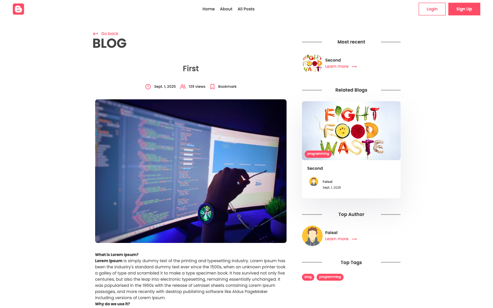
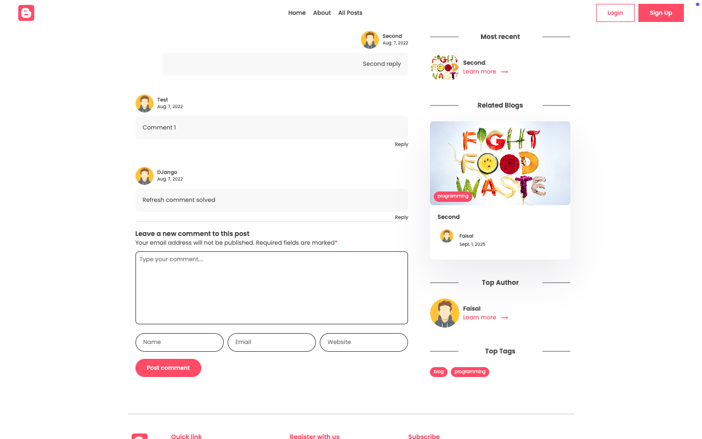
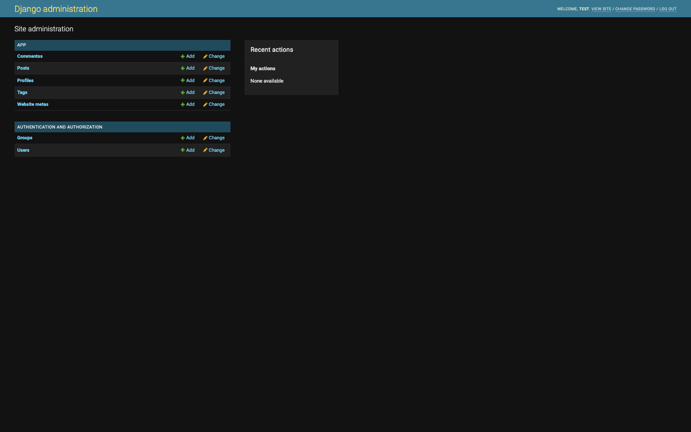
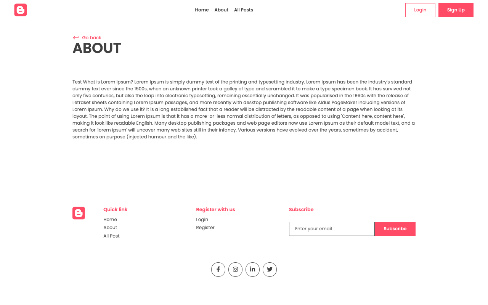
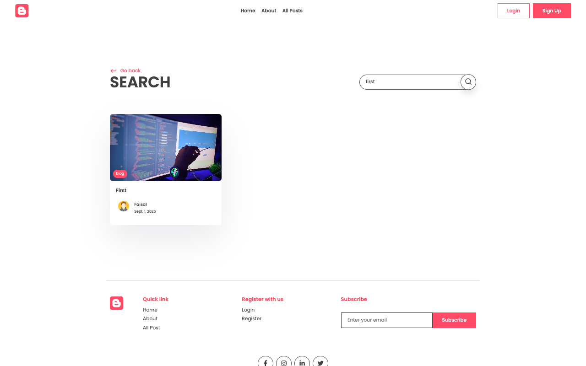
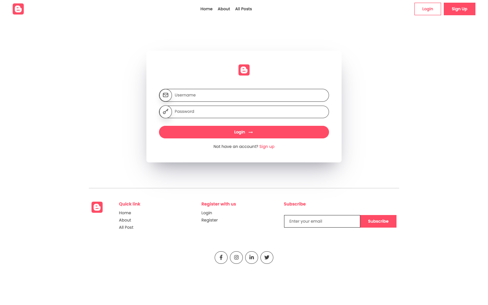
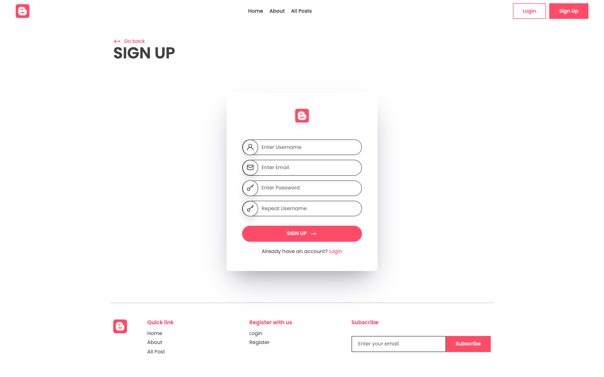

# Django Blog Application

A feature-rich, modern blog platform built with Django. This application supports user registration, profile management, post creation, tagging, comments (with threaded replies), likes, bookmarks, and email subscriptions. It is designed for easy deployment and extensibility.

## Data Model Overview

- **User**: Django’s built-in user model for authentication and authoring content.
- **Profile**: Extends User with avatar, bio, and a unique slug.
- **Post**: Blog post with title, content, image, tags, author, likes, bookmarks, and view count.
- **Tag**: Categorizes posts for easier navigation and filtering.
- **Comment**: Supports threaded replies, linked to posts and optionally users.
- **Subscribe**: Stores email subscriptions for blog updates.
- **WebsiteMeta**: Stores site-wide metadata (title, description, about).

### Relationships

- Each `Profile` is linked to one `User` (one-to-one).
- Each `Post` is authored by a `User` and can have multiple `Tags` (many-to-many).
- Each `Comment` is linked to a `Post` and can have a parent comment (for replies).
- Users can like and bookmark multiple posts (many-to-many).

## Features

- User authentication and registration
- User profiles with avatars and bios
- Create, edit, and delete blog posts
- Tagging system for posts
- Commenting system with threaded replies
- Like and bookmark posts
- Email subscription for updates
- Featured posts and view counts
- Admin dashboard for content management
- Responsive UI (see screenshots below)

## Technologies Used

- Python 3
- Django 4
- SQLite (default, can be swapped for PostgreSQL/MySQL)
- Pillow (image handling)
- Gunicorn (production server)
- Whitenoise (static files)
- AWS S3 (optional, via django-storages & boto3)

## Setup Instructions

1. **Clone the repository:**
   ```bash
   git clone <repo-url>
   cd blogify
   ```
2. **Create and activate a virtual environment:**
   ```bash
   python -m venv env
   source env/bin/activate  # On Windows: env\Scripts\activate
   ```
3. **Install dependencies:**
   ```bash
   pip install -r requirements.txt
   ```
4. **Apply migrations:**
   ```bash
   python manage.py migrate
   ```
5. **Create a superuser (admin):**
   ```bash
   python manage.py createsuperuser
   ```
6. **Run the development server:**
   ```bash
   python manage.py runserver
   ```
7. **Access the app:**
   - Blog: http://127.0.0.1:8000/
   - Admin: http://127.0.0.1:8000/admin/

## Usage

- Register a new user or log in.
- Create and manage your profile.
- Write, edit, and delete blog posts.
- Tag your posts for better discoverability.
- Comment on posts and reply to others.
- Like and bookmark your favorite posts.
- Subscribe with your email for updates.

## Screenshots

Below are some screenshots of the application:

| Home Page | Blog Post | Comments |
|-----------|-----------|----------|
|  |  |  |

| Admin Dashboard | About Page | Search |
|-----------------|------------|--------|
|  |  |  |

| Login | Signup |
|-------|--------|
|  |  |

## Contributing

Contributions are welcome! Please open an issue or submit a pull request.

1. Fork the repository
2. Create your feature branch (`git checkout -b feature/YourFeature`)
3. Commit your changes (`git commit -am 'Add some feature'`)
4. Push to the branch (`git push origin feature/YourFeature`)
5. Open a pull request

## License

This project is licensed under the MIT License.
